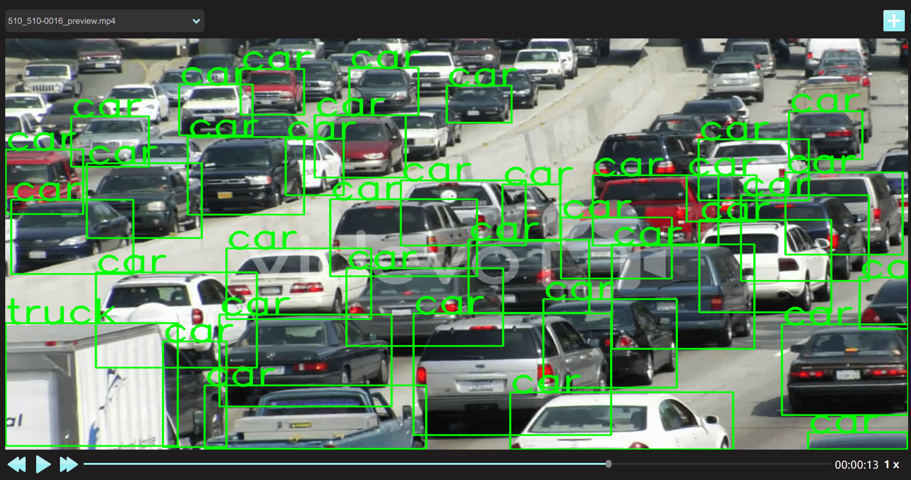

<h1 align="center">
  <br/>cvplayer
</h1>

<h4 align="center">
  Universal media player for computer vision models and their inferences 
</h4>
<br/>

<div align="center">
  
</div>

## Description

Welcome to **CVPlayer**, a powerful and easy to use tool for visualizing computer vision models inferences.  
Tired of writing long codes just to visualize your model's output? With CVPlayer, you can easily analyze the output of your models with just a few lines of code, no mather wich library or framework you are using, saving you from long codes for a simple inference visualization and ofering you an a lot better experience over the traditional way of doing it.

## Features
- [x] Video inference visualization.
- [x] Images inference visualization.
- [x] Compatible with any computer vision framework.
- [x] Frame level control.
- [x] Easy to use.
- [ ] Portable for PyQt6 aplications.
- [ ] Manipulate the player by an internal API.


## Requirements

### pip

```bash
# inside your env
pip install PyQt6==6.4.2 PyQt6-Qt6==6.4.2 PyQt6-sip==13.4.1
pip install opencv-python
pip install pillow
```
## Instalation

```bash
# inside your env
git clone https://github.com/edu010101/cvplayer
cd cvplayer
pip install -e .
```
## Usage

### Tutorials
A colab tutorial for getting started with cvplayer [](tutorial.ipynb)

### Video Player

```python
from cvplayer import VideoPlayer

#create a class with any name
class ExampleName():
    def __init___(self): #it can have many args as you need
        #initialize your model
        self.model = 'path/to/your/model'
    
    #your class NEED to have this method with this exactly name.
    def custom_method(self, numpy_image): #this method can have just the np.array parameter
      	#this method receives an np.array representing your image or frame
      	#then modify and inference your array as you want
	
    	return numpy_image  #then return your modified np.array

VideoPlayer(ExampleName()) #load your class as an argument to the player
```
### Image Player

```python
from cvplayer import ImagePlayer

#create a class with any name
class ExampleClass():
    def __init___(self): #it can have many args as you need
        #initialize your model
        self.model = 'path/to/your/model'
    
    #your class NEED to have this method with this exactly name.
    def custom_method(self, numpy_image):
      	#this method receives an np.array representing your image or frame
      	#modify and inference your array as you want
	
    	return numpy_image  #then return your modified np.array

imageclassifier = ExampleClass()
ImagePlayer(imageclassifier) #load your class as an argument to the player
```

### Yolov8 demo

```python
from cvplayer import VideoPlayer
from ultralytics import YOLO
import cv2

#yolov8 example
class Yolov8(): 
    def __init__(self) -> None:
        self.model = YOLO("yolov8n.pt")  # load a pretrained model 
    
    def custom_method(self, image): #method to be called on each frame and do whatever you want
        results = self.model(image)  # predict on an image
        for result in results:
            boxes = result.boxes  # Boxes object for bbox outputs
            for box in boxes:
                cv2.rectangle(image, (int(box.xyxy[0][0]), int(box.xyxy[0][1])), (int(box.xyxy[0][2]), int(box.xyxy[0][3])), (0, 255, 0), 2)
        
        return image #return the image with the changes
    
VideoPlayer(Yolov8()) #pass the class to the VideoPlayer and start the player
```

### mmdetection demo

```python
from cvplayer import VideoPlayer
from mmdet.apis import inference_detector, init_detector

#mmdectection example
class FasterRCNN():
    def __init__(self) -> None: #always load the model in the constructor
        model_config='your_path_to_config/faster_rcnn_r50_fpn_1x.py' #you can use any model from mmdetection
        model_weights='your_path_to_weights/epoch_50.pth' 
        self.detection_model = init_detector(model_config, model_weights, device='cuda:0')
        
    def custom_method(self, numpy_image):
        detection_result = inference_detector(self.detection_model, numpy_image)
        return self.detection_model.show_result(numpy_image, detection_result, score_thr=0.7, show=False)

ImagePlayer(FasterRCNN()) #pass the class to the ImagePlayer and start the player

```